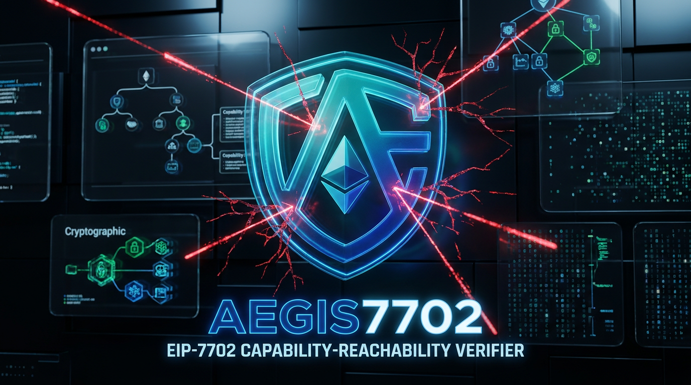

# Aegis7702: Capability-Aware Multi-Step Reachability Verifier

[](https://github.com/lewbei/aegis7702/actions)
[-emerald)](./testdata/AEGIS_USENIX_EVALUATION.md)
[](./contracts)
[](./engine)
[](https://eips.ethereum.org/EIPS/eip-7702)
[](https://github.com/Uniswap/permit2)

> **Aegis7702** is a typed capability-reachability verifier and state-specific recovery engine for Ethereum Prague EIP-7702 authorizations and Uniswap Permit2 signatures. It turns zero-delta signing traps into executable loss proofs with verified, state-specific recovery.
>
> Built for the **3rd-Web-Hack Hackathon** (TechZap Club, Sept 2026).

---

## ⚡ Executive Summary: Grounded in Real Threat Intelligence

<p align="center">
  
</p>

Instead of hand-crafted toy scenarios or ambiguous heuristic scores, Aegis7702 is empirically grounded in the **USENIX Security 2026** artifact (Huang et al.):

| **58** USENIX-derived chain-address cases | **51 / 58** Exploit Witnesses (87.9%) | **51 / 51** Clean-State Replay | **51 / 51** Neutralized by Recovery |
| :---: | :---: | :---: | :---: |
| Complete $C$ inclusion set across 6 chains | Executable EVM loss witnesses discovered | 100% concrete loss reproducibility on fresh state | 100% mitigated ($L=0$) via on-chain recovery |

> 🔗 **Verifiable CI Logs:** The full 58-case benchmark executes end-to-end against live Prague EVM instances directly in GitHub Actions CI. See [Latest Release CI Run (Run #35972326804)](https://github.com/lewbei/aegis7702/actions/runs/35972326804) and the full 58-case execution matrix in [`testdata/AEGIS_USENIX_EVALUATION.md`](./testdata/AEGIS_USENIX_EVALUATION.md).

---

## 🚀 Judge Quickstart

You do **not** need to wait for the 30-minute full 58-case benchmark to verify Aegis7702. Run our self-contained end-to-end verification pipeline:

```bash
# Clone and enter repo
git clone https://github.com/lewbei/aegis7702.git
cd aegis7702

# 1. Run Foundry contract security suite (14 tests in 13ms)
make test-contracts   # or: cd contracts && forge test -v

# 2. Run TypeScript reachability kill tests & adversarial recovery scenarios (fast local execution)
make test-engine      # or: cd engine && npm test

# 3. Launch the Interactive Prototype Dashboard
make demo             # Launches engine API (:3099) & Vite UI (:5173)
```

---

## 1. The Core Problem: The Single-Step Simulation Fallacy

Conventional execution simulation answers what a proposed execution does under a particular current state. Detached authorization capabilities introduce a fundamentally different question: **what future attacker-controlled state transitions become reachable after the signed capability is released?**

### The Mathematical Flaw
$$\boxed{\text{SimulateCurrentExecution}(c, s_0) \not\Rightarrow \text{SafeFutureCapability}(c, s_0)}$$

1. **Detached Authorization:** The signing event is physically detached from its eventual on-chain consumption. The authorization can later be included in an EIP-7702 Type-0x04 transaction or a Permit2 permit call.
2. **Zero Immediate Delta:** When an end-user signs an off-chain authorization, **zero state changes occur on-chain**. An immediate-delta baseline evaluates:
   $$\Delta \text{Balance}(s_0) = \$0.00$$
3. **Dangerous False Negatives:** An authorization may cause zero immediate state change while enabling a later loss-producing execution path. An immediate-delta baseline marks the capability as safe purely because no balance moved at Step 0.
4. **Asynchronous Drainage:** An attacker subsequently relays the signed authorization in a Type-0x04 transaction or Permit2 call, installs malicious delegation code or allowance, and executes a multi-step asset drain.

Recent empirical research highlights this threat surface:
- **USENIX Security 2026 (Huang et al.):** USENIX Security 2026 reports that, across its seven-chain dataset, over **63% of observed EIP-7702 authorization transactions** were associated with malicious EOA-targeted attacks (identifying 924 malicious contract accounts, >$2.3M in realized losses, and >$10M exposed).

---

## 2. The Aegis7702 Solution

Instead of assuming arbitrary protocol semantics or relying on simple blacklist pattern matching, Aegis7702 models off-chain capabilities as **reachable state transitions** in an ephemeral local EVM environment (Anvil):

```text
Signed Capability (c)
       │
       ▼
Capability Decoder: Decode(c)
       │
       ▼
Action Generator: Legal Candidate Transitions 𝒜_modeled(c, s)
       │
       ▼
Bounded DFS Reachability Explorer (k ≤ 3, Anvil Snapshots)
       │
       ├──► No Loss Path Found:
       │    No modeled loss path found within supported action semantics and depth k ≤ 3
       │    (¬Unsafe_{≤ k}^{𝒜_modeled}(c, s₀))
       │
       └──► Loss Path Found:
            Concrete Vulnerability Witness π = (a₁, ..., aⱼ), j ≤ 3 s.t. L(s₀, T_π(s₀)) > 0
                    │
                    ▼
            Synthesize State-Specific Recovery Action: Recovery(c, s) ⟶ s_R
                    │
                    ▼
            Execute Recovery Action On-Chain
                    │
                    ▼
       Replay Discovered Exploit Trace Replay(π, s_R) ──► NEUTRALIZED (L(s_R, T_π(s_R)) = 0)
       (Exploit reverts or no-ops; tracked asset balances unchanged)
```

### Formal Verification Asymmetry

Aegis7702 enforces an explicit, asymmetric verification contract:

$$\boxed{\text{Found loss path } \pi \implies \text{concrete vulnerability witness under fork state } s_0}$$

$$\boxed{\text{No path found} \not\implies \text{globally safe (establishes } \neg Unsafe_{\le k}^{\mathcal A_{\text{modeled}}}(c,s_0) \text{ only)}}$$

- **Positive Counterexample:** When a path $\pi = (a_1, \ldots, a_j)$ is discovered at depth $j \le 3$, Aegis7702 executes each step on an ephemeral Anvil state and measures $L(s_0, T_\pi(s_0)) > 0$. This provides a concrete, executable counterexample witness proving the capability is unsafe under state $s_0$.
- **Bounded Verification Limit:** When no loss path is found, Aegis7702 proves only that no loss trace exists within the supported action generators $\mathcal A_{\text{modeled}}$ and depth bound $k \le 3$. The depth bound $k \le 3$ captures canonical multi-step exploit sequences (Step 1: capability relay/permit injection $\to$ Step 2: asset transfer/sweep $\to$ Step 3: optional vault unwind/intermediate transfer) while keeping Anvil EVM snapshot branching linear and lightweight. This avoids heuristic "risk scores" while remaining mathematically honest: it is not a proof of global safety against unmodeled actions or deeper sequences ($k > 3$).
- **Loss Metric Definition:** The general loss formulation evaluates the net reduction in victim assets across state transitions:
  $$L(s_0, s') = \sum_{t \in \text{Tracked}} \max(0, \text{Balance}_{t,\text{victim}}(s_0) - \text{Balance}_{t,\text{victim}}(s'))$$
  In the current prototype implementation, Aegis7702 specifically tracks and measures the primary capability-associated ERC-20 token (e.g., USDC) to establish concrete counterexample witnesses with minimal overhead, with multi-asset ETH/ERC-20 aggregate blast radius tracking designated for subsequent production expansion.
- **Action Space Bounds ($\mathcal{A}_{\text{modeled}}$):**
  - *In Scope / Modeled:* Canonical Permit2 `permit` and `permitTransferFrom` invocations, EIP-7702 Type-0x04 delegation relays, and direct token drain / delegation `sweep` calls.
  - *Out of Scope / Future Work:* Arbitrary external DeFi composability (flash-loan-assisted liquidations, multi-hop DEX arbitrage, nested protocol reentrancy).

### Supported Capability Semantics & Recovery Mechanisms

1. **EIP-7702 Authorization Tuples (Prague Hardfork):**
   - *Exploration:* Attacker relays authorization tuple via an EIP-7702 Type-0x04 transaction installing `0xef0100 || delegateAddress` $\to$ Attacker calls `sweep()` in victim EOA context.
   - *Recovery:*
     - **Unconsumed Authorization:** Advances victim account nonce via a 0-value self-transaction. Under EIP-7702 rules (`authority.nonce == auth.nonce`), the stolen authorization tuple is **invalidated by nonce mismatch**.
     - **Active Delegation:** Generates a Type-0x04 recovery transaction with authorization pointing to `address(0)`, immediately clearing the delegation indicator back to a clean EOA.
     - *Race Condition Qualification:* Neutralization is strictly subject to mining order:
       $$\text{Recovery mined first} \implies \text{old authorization invalid by nonce mismatch}$$
       If an attacker transaction consumes the authorization before recovery is mined, the malicious transition may land first.
     - *Operational Recommendation:* To mitigate frontrunning risk in public mempools, recovery transactions (such as nonce advance or Permit2 invalidation) should be broadcast via private RPC endpoints (e.g., Flashbots Protect or MEV-share). In adversarial public mempools, the self-transaction must be submitted with elevated `maxPriorityFeePerGas` (EIP-1559 replacement pricing) to prevent transaction underpricing or eviction.
2. **Uniswap Permit2 AllowanceTransfer:**
   - *Exploration:* Attacker broadcasts `PermitSingle` payload $\to$ Attacker calls `Permit2.transferFrom()`.
   - *Recovery:* Calls canonical `Permit2.invalidateNonces(token, spender, newNonce)` operating on caller identity, advancing the nonce to neutralize the permit before broadcast; or calls `Permit2.lockdown()` to zero active allowances.
3. **Uniswap Permit2 SignatureTransfer:**
   - *Exploration:* Attacker executes `Permit2.permitTransferFrom()` via signed unordered nonce bitmap.
   - *Recovery:* Calls canonical `Permit2.invalidateUnorderedNonces(wordPos, mask)` operating on caller identity to flip the target bitmap bit, permanently invalidating the nonce.

---

## 3. Architecture & Repository Structure

```
.
├── Makefile                    # Root automation: test, test-contracts, test-engine, demo
├── contracts/                  # Solidity smart contracts & Foundry test suites
│   ├── src/
│   │   ├── MockUSDC.sol        # Solmate ERC20 test token fixture
│   │   ├── MaliciousDelegate.sol # Controlled EIP-7702 drain fixture (sweep/execute)
│   │   └── Guard7702Sentinel.sol # Batch invalidation & emergency recovery sentinel
│   ├── test/
│   │   ├── Permit2Allowance.t.sol # 4/4 PASS (Multi-step drain & recovery)
│   │   ├── Permit2Signature.t.sol # 3/3 PASS (Unordered nonce drain & recovery)
│   │   ├── EIP7702Attack.t.sol    # 4/4 PASS (Prague Type-4 relay, nonce advance, address(0) clear)
│   │   └── Guard7702Sentinel.t.sol # 3/3 PASS (Delegated context batch invalidations & griefing prevention)
│   └── foundry.toml            # Solc 0.8.17, via_ir = true, Prague EVM settings
│
├── engine/                     # TypeScript Capability-Reachability Engine
│   ├── src/
│   │   ├── capability/
│   │   │   ├── types.ts            # Typed Capability, Action, SearchNode, Counterexample
│   │   │   ├── abis.ts             # Permit2, ERC20, and MaliciousDelegate ABIs
│   │   │   ├── decodePermit2Allowance.ts # Wallet EIP-712 PermitSingle capability decoder
│   │   │   ├── decodePermit2Signature.ts # Wallet EIP-712 PermitTransferFrom decoder
│   │   │   ├── decode7702.ts       # EIP-7702 authorization tuple decoder
│   │   │   └── decodeCapability.ts # Universal capability dispatcher
│   │   ├── semantics/
│   │   │   ├── permit2Allowance.ts # Permit2 AllowanceTransfer action generator
│   │   │   ├── permit2Signature.ts # Permit2 SignatureTransfer action generator
│   │   │   └── eip7702.ts          # EIP-7702 Type-4 relay & sweep action generator
│   │   ├── recovery/
│   │   │   ├── permit2.ts          # Nonce invalidation & allowance lockdown planner
│   │   │   ├── permit2Signature.ts # Unordered nonce bitmap invalidation planner
│   │   │   └── eip7702.ts          # Nonce advance & address(0) delegation planner
│   │   ├── search/
│   │   │   └── explorer.ts     # Bounded DFS explorer using Anvil snapshots & reverts
│   │   ├── server.ts           # Lightweight HTTP API server bridging engine to web app
│   │   ├── killTest.ts         # Permit2 AllowanceTransfer end-to-end kill test (100% PASS)
│   │   ├── killTestSignature.ts# Permit2 SignatureTransfer end-to-end kill test (100% PASS)
│   │   ├── killTest7702.ts     # EIP-7702 Prague Hardfork end-to-end kill test (100% PASS)
│   │   └── evalUsenixReal.ts   # 58-case USENIX 2026 real artifact evaluation runner
│   └── package.json
│
└── app/                        # Interactive Next/Vite React Proof Visualizer Dashboard
    ├── src/
    │   ├── App.tsx             # Interactive scenario runner, live Anvil execution & replay tester
    │   └── index.css           # Tailwind CSS v4 cyberpunk/fintech dark theme
    └── package.json
```

---

## 4. Quickstart & Verification Reproduction

### Prerequisites
- Node.js >= 20 (`node -v`, tested on Node 20 & 22)
- Foundry / Anvil >= 1.8 (`forge --version`, `anvil --version`)
- *Offline Execution:* All test suites and benchmarks execute completely offline against local Anvil state without requiring external RPC keys or mainnet connectivity.

### Step 1: Run Foundry Solidity Test Suite
Verify all 14 smart contract security tests covering baseline delta, multi-step exploit execution, caller authorization checks, and mitigation:

```bash
cd contracts
forge test -v
```

Expected output:
```
Ran 3 tests for test/Permit2Signature.t.sol:Permit2SignatureTest   (3 passed)
Ran 4 tests for test/Permit2Allowance.t.sol:Permit2AllowanceTest   (4 passed)
Ran 4 tests for test/EIP7702Attack.t.sol:EIP7702AttackTest         (4 passed)
Ran 3 tests for test/Guard7702Sentinel.t.sol:Guard7702SentinelTest (3 passed)
Suite result: ok. 14 passed; 0 failed; 0 skipped
```

### Step 2: Run TypeScript Reachability Engine & Integration Tests
Run all 3 automated kill tests and 5 adversarial integration scenarios with a single command. Each test script automatically spawns, orchestrates, and tears down ephemeral local Anvil child processes (supporting Prague hardfork for EIP-7702; requires `anvil` in `$PATH` or via `ANVIL_BIN`), decodes raw wallet signatures via Capability Decoders, executes multi-step reachability discovery, generates recovery transactions, and proves on-chain that exploit replay is neutralized:

```bash
cd engine
npm ci
npm test
```

Individual test & benchmark targets:
```bash
npm run kill:allowance     # Permit2 AllowanceTransfer Kill Test
npm run kill:signature     # Permit2 SignatureTransfer Kill Test
npm run kill:7702          # EIP-7702 Prague Hardfork Kill Test
npm run test:integration   # 5 Adversarial Recovery Scenarios (Future nonces, clear delegation, max delta)
npm run eval:usenix         # Aegis7702-USENIX-Eval: Executable benchmark on real USENIX '26 bytecodes
```

### Step 3: Run Interactive Prototype Dashboard
Launch the interactive web UI to inspect signed capabilities, view the immediate-delta baseline comparison, explore the reachability graph, and trigger on-chain recovery execution:

```bash
# Terminal 1: Launch engine API server (enables live Anvil execution from UI)
cd engine
npm run server

# Terminal 2: Launch React frontend
cd app
npm ci
npm run dev
```
Open `http://localhost:5173` in your browser. (The dashboard automatically detects the live engine server on port 3099, executing live Anvil reachability searches and on-chain mitigations in real time, with seamless client fixture fallback if offline).

### Step 4: Sepolia Testnet Deployment Script (Optional)
To deploy the `Guard7702Sentinel` and `MaliciousDelegate` contracts to Ethereum Sepolia testnet:
```bash
cd contracts
forge script script/DeploySentinel.s.sol --rpc-url <SEPOLIA_RPC_URL> --broadcast
```

### Step 5: Official 3-Minute Presentation Walkthrough
A complete second-by-second presentation script with on-screen visual cues and voiceover text is documented in [docs/DEMO_VIDEO_SCRIPT.md](./docs/DEMO_VIDEO_SCRIPT.md).

---

## 5. Formal Stopping Criterion

Aegis7702 enforces a deterministic executable stopping criterion against live EVM state snapshots:

$$\boxed{L(s_0, T_\pi(s_0)) > 0 \quad\land\quad L(s_R, T_\pi(s_R)) = 0}$$

Every verified capability counterexample satisfies:
1. **Immediate-Delta Baseline:** Immediate balance change at depth 0 is proven to be $\Delta = \$0.00$ (demonstrating the false negative of current-state simulation).
2. **Positive Counterexample:** Reachability explorer successfully discovers an executable exploit trace $\pi$ with $L(s_0, T_\pi(s_0)) > 0$ on reconstructed EVM state.
3. **Recovery Construction:** Engine synthesizes the exact, state-specific recovery transaction $s \to s_R$.
4. **Deterministic Executable Verification:** Aegis7702 replays the identical counterexample $\pi$ against the post-recovery state $s_R$ and verifies that the previously successful exploit trace is neutralized ($L=0$, via on-chain revert or clean-state no-op), keeping tracked asset balances unchanged under the replayed trace.

---

## 6. Academic References & Citations

1. **Huang, M., et al. (USENIX Security 2026).** *Revealing the Dark Side of Smart Accounts: An Empirical Study of EIP-7702 Incurred Risks in Blockchain Ecosystem*. USENIX Security Symposium.
2. **Hauser, M. (2026).** *Write-Domain Separation and Non-Custodial Enforcement: A Structural Impossibility in Account-Based Ledgers, with a Commitment-Based Construction*. arXiv:2605.01210.
3. **Ethereum Foundation.** *EIP-7702: Set EOA account code for one transaction*. [EIPs Repository](https://eips.ethereum.org/EIPS/eip-7702).
4. **Uniswap Labs.** *Permit2: Signature-based token approvals and transfers*. [GitHub](https://github.com/Uniswap/permit2).
5. **Blockaid Security Research (2025).** *Signature Harvesting and Delayed Drainer Exploits in Web3*.

---

## 7. Research & Safety Disclaimer

*Aegis7702 is a hackathon research prototype and bounded reachability verifier. While recovery transactions deterministically neutralize exploit replays on ephemeral EVM snapshots, live mainnet mitigations operate in adversarial mempools subject to miner extraction and gas auction dynamics. In live production environments, recovery transactions should be dispatched via private RPC endpoints (e.g., Flashbots Protect).*
