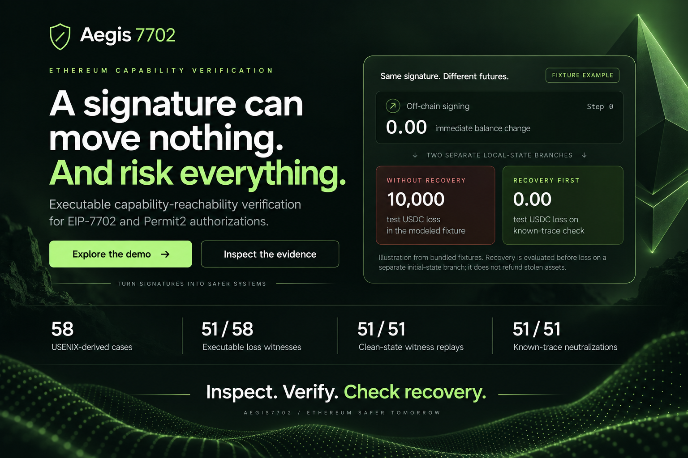
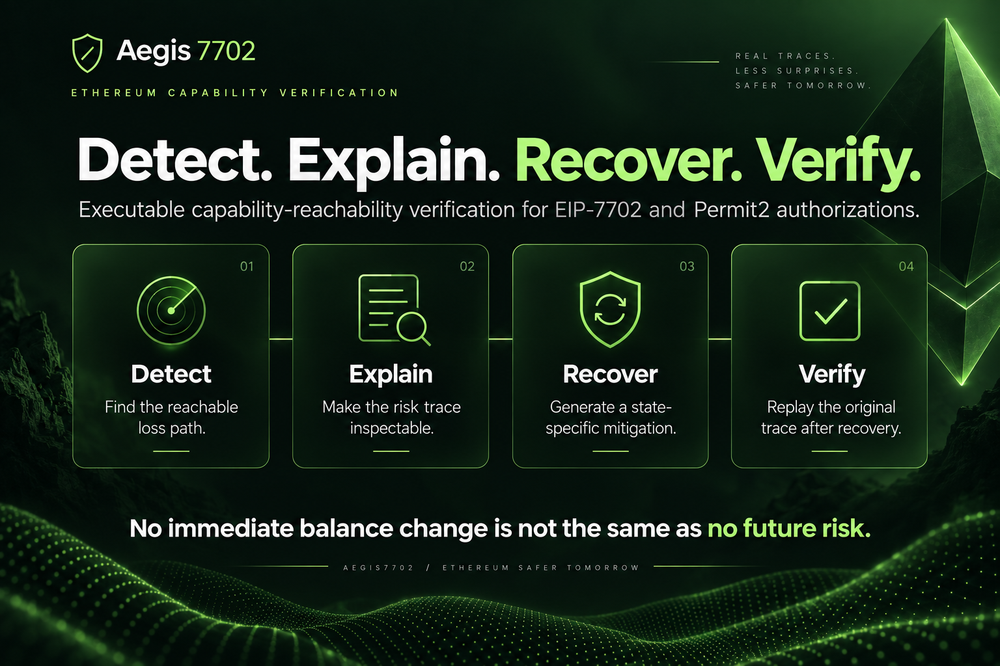
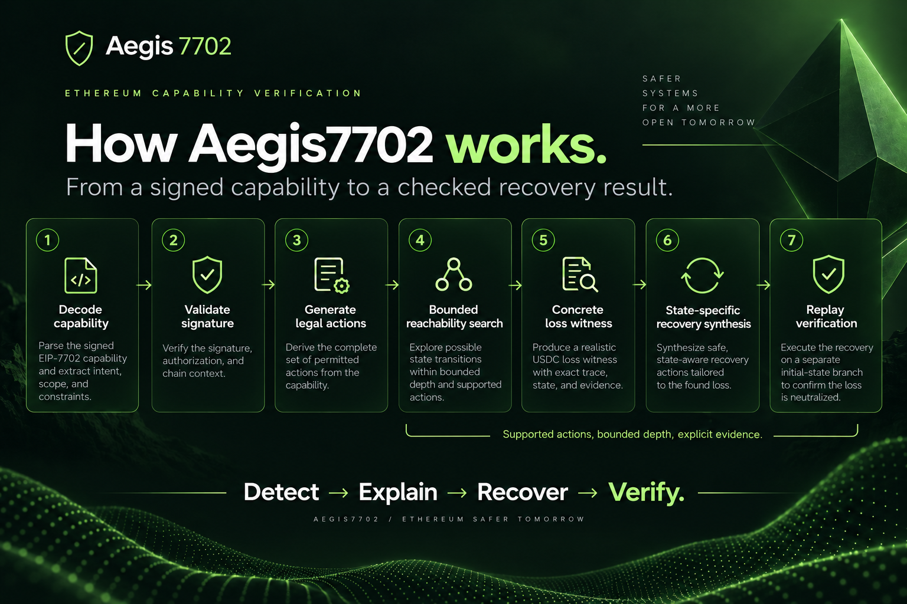
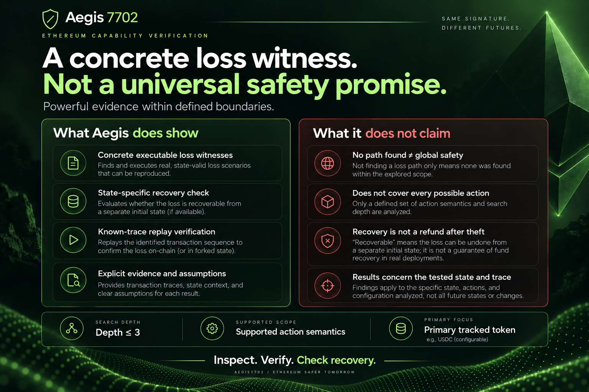
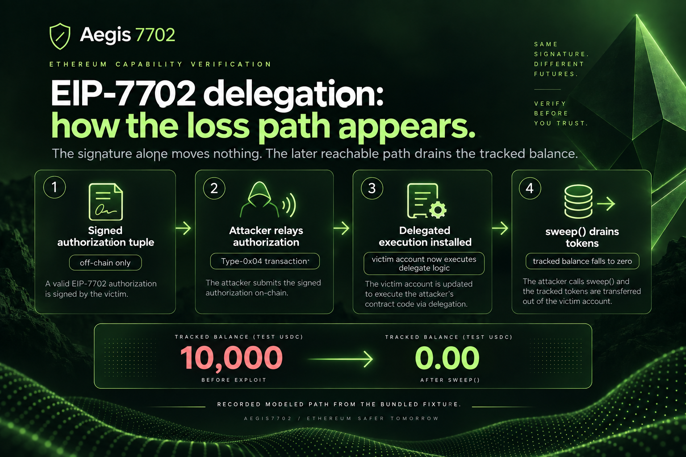
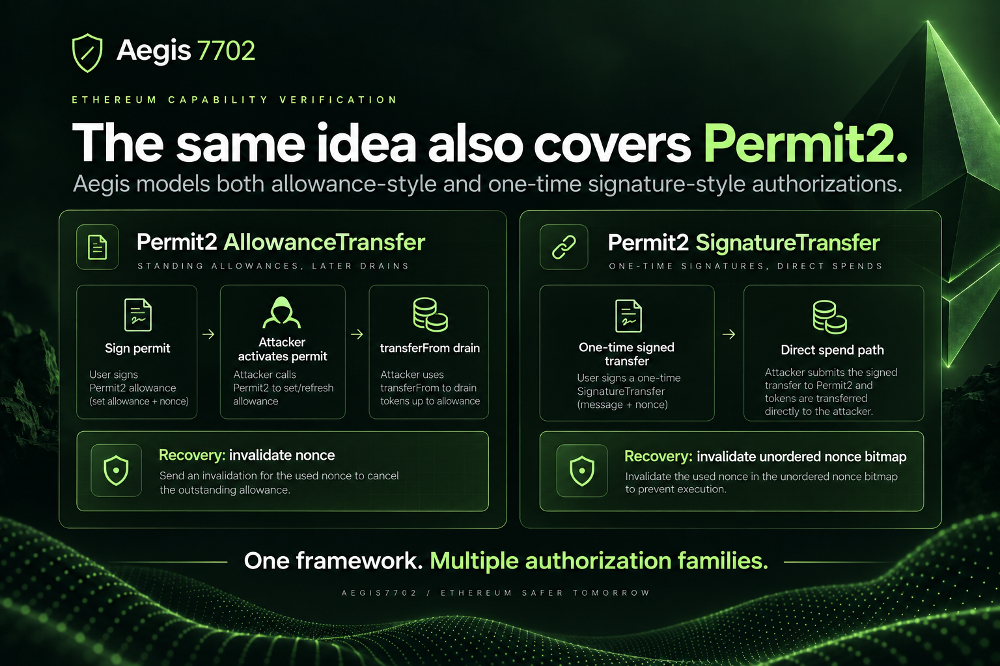
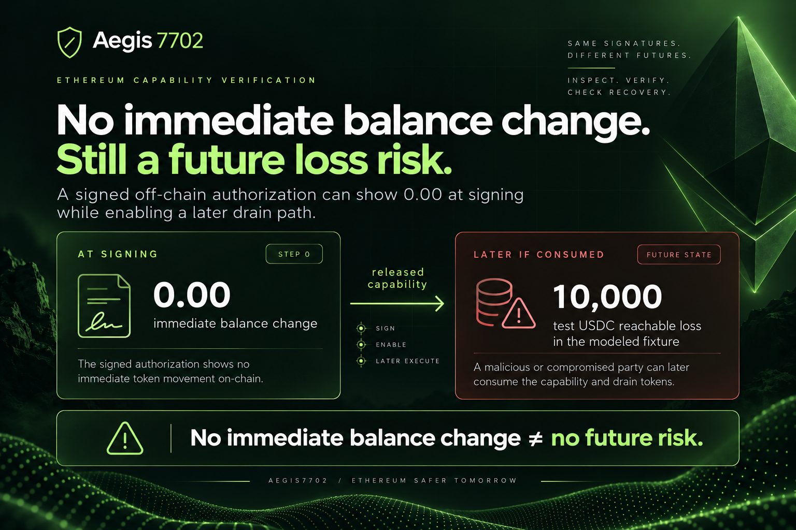
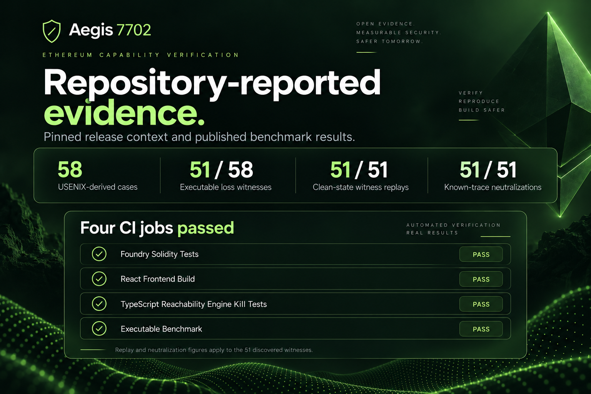
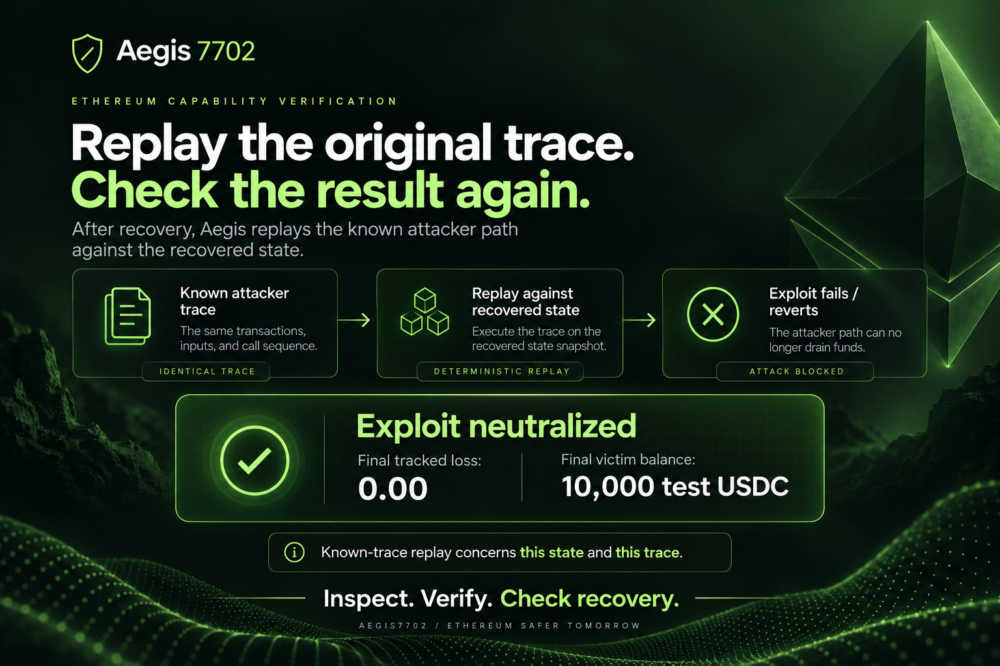
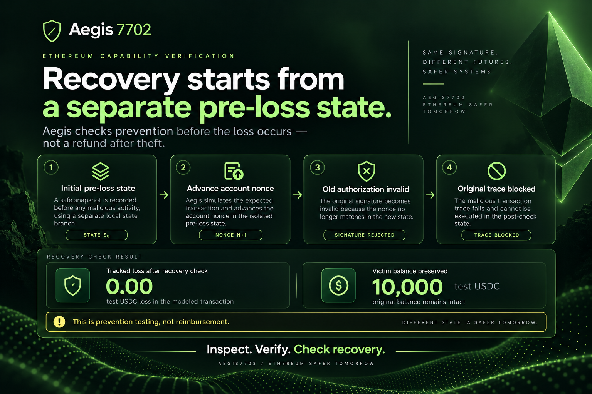

# Aegis7702 — Official Presentation & Showcase Deck

> **"A signature can move nothing. And risk everything."**  
> **Aegis7702** is a capability-aware multi-step reachability verifier and state-specific recovery engine for Ethereum Prague EIP-7702 authorizations and Uniswap Permit2 signatures.

---

## 🎥 Final Demo Walkthrough (Voiceover & Captions)

The official final presentation video walkthrough is available on YouTube and archived directly in this repository:
- 📺 **Watch on YouTube:** [https://youtu.be/lUrXpTSM36Q](https://youtu.be/lUrXpTSM36Q)
- 💾 **Repository Video:** [`showcase/Aegis7702_Final_Demo_Voiceover_Captioned.mp4`](./Aegis7702_Final_Demo_Voiceover_Captioned.mp4)
- **Format:** 1080p Full HD (`1920 × 1080`), 25 FPS, 4m 44s, with full voiceover narration and synced subtitles.

---

## 🖼️ Official Presentation Pitch Deck

The following 10 slides form the official presentation slide deck for hackathon judges, security researchers, and developers.

| Slide # | Slide Title | Key Narrative Takeaway |
| :---: | :--- | :--- |
| **01** | [Cover & Core Thesis](#slide-01--cover--the-core-thesis) | A signature can move nothing ($0.00 today) and risk everything ($10,000 later). |
| **02** | [Four Pillars](#slide-02--four-pillars-detect-explain-recover-verify) | **Detect** the loss path, **Explain** the trace, **Recover** on clean state, **Verify** via replay. |
| **03** | [System Architecture](#slide-03--system-architecture-how-aegis7702-works) | End-to-end 7-step pipeline from signed capability decoding to replay verification. |
| **04** | [Honest Verification Boundary](#slide-04--honest-verification-boundary) | Concrete loss witnesses within bounded depth ($k \le 3$); never claim unmodeled global safety. |
| **05** | [EIP-7702 Delegation Attack](#slide-05--eip-7702-delegation-the-exploit-path) | The 4-step anatomy of an EIP-7702 zero-delta trap, relay, delegation, and sweep drain. |
| **06** | [Permit2 Multi-Protocol Breadth](#slide-06--permit2-multi-protocol-breadth) | Extends natively to Uniswap Permit2 `AllowanceTransfer` and `SignatureTransfer`. |
| **07** | [The Zero-Delta Fallacy](#slide-07--the-zero-delta-fallacy) | Mathematical proof of why status quo wallet simulators fail to detect deferred risk. |
| **08** | [Repository-Reported Evidence](#slide-08--repository-reported-evidence--ci) | Grounded in USENIX Security 2026: 51/58 witnesses discovered, 4/4 green CI jobs. |
| **09** | [Deterministic Replay Proof](#slide-09--deterministic-replay-neutralization) | Replaying the attacker trace halts on-chain with revert; $100\%$ funds preserved ($L=0$). |
| **10** | [Counterfactual Recovery Principle](#slide-10--counterfactual-pre-loss-recovery) | Proactive defense tested on a clean pre-loss state snapshot—prevention, not reimbursement. |

---

### Slide 01 — Cover & The Core Thesis

> *"When an off-chain authorization is signed, zero tokens move on-chain at Step 0. Status quo wallets declare the transaction safe. Aegis7702 proves that no immediate balance change is NOT no future risk."*

---

### Slide 02 — Four Pillars: Detect, Explain, Recover, Verify

> *The complete verification lifecycle: Detect reachable loss paths $\to$ Explain the risk trace with full opcodes $\to$ Recover using state-specific actions $\to$ Verify mitigation on clean state snapshots.*

---

### Slide 03 — System Architecture: How Aegis7702 Works

> *The 7-step formal pipeline: (1) Decode Capability $\to$ (2) Validate Signature $\to$ (3) Generate Legal Actions $\to$ (4) Bounded Reachability Search ($k \le 3$) $\to$ (5) Concrete Loss Witness $\to$ (6) State-Specific Recovery Synthesis $\to$ (7) Replay Verification.*

---

### Slide 04 — Honest Verification Boundary

> *A formal verifier must be mathematically honest: A discovered loss path $\pi$ is a concrete counterexample witness under state $s_0$. Finding no loss path within depth $k \le 3$ is not a claim of global safety against unmodeled opcodes or deeper paths.*

---

### Slide 05 — EIP-7702 Delegation: The Exploit Path

> *How the attack occurs in practice: (1) Victim signs off-chain delegation tuple $\to$ (2) Attacker relays authorization via Type-0x04 transaction $\to$ (3) Delegated execution installed $\to$ (4) Attacker calls `sweep()` draining 10,000 USDC.*

---

### Slide 06 — Permit2 Multi-Protocol Breadth

> *A single unified reachability engine protects both EIP-7702 and Uniswap Permit2. It handles sequential nonce bumbing for `AllowanceTransfer` and 256-bit bitmap manipulation for `SignatureTransfer`.*

---

### Slide 07 — The Zero-Delta Fallacy

> *Why single-step simulation is fundamentally broken: At signing (Step 0), the immediate balance change is $0.00. But once released, the capability enables a future state transition that wipes out the account.*

---

### Slide 08 — Repository-Reported Evidence & CI

> *Empirically evaluated against the USENIX Security 2026 dataset (Huang et al.): 58 chain-address cases $\to$ 51 discovered witnesses ($87.9\%$) $\to$ 51 clean replays ($100\%$) $\to$ 51 neutralized ($100\%$). All 4 CI jobs passing on pinned release `v1.0.13`.*

---

### Slide 09 — Deterministic Replay Neutralization

> *Physical evidence of mitigation: Replaying the identical attacker trace against the post-recovery state halts on-chain with an EVM revert (`Authorization Nonce Mismatch` or `InvalidNonce`). Net loss remains 0.00 USDC.*

---

### Slide 10 — Counterfactual Pre-Loss Recovery

> *The recovery contract is proactive prevention, not reimbursement. Aegis7702 evaluates defense on a separate initial-state snapshot before the attacker consumes the capability, ensuring the authorization is permanently dead before theft occurs.*

---

## 🚀 Interactive Exploration Links

- **Interactive Prototype UI:** `http://localhost:5173/` or run `make demo`
- **Standalone Offline Judge Walkthrough:** [`app/public/judge-demo.html`](../app/public/judge-demo.html)
- **Three-Minute Presentation Script:** [`docs/WEBSITE_DEMO_SCRIPT.md`](../docs/WEBSITE_DEMO_SCRIPT.md)
- **USENIX 58-Case Evaluation Matrix:** [`testdata/AEGIS_USENIX_EVALUATION.md`](../testdata/AEGIS_USENIX_EVALUATION.md)
